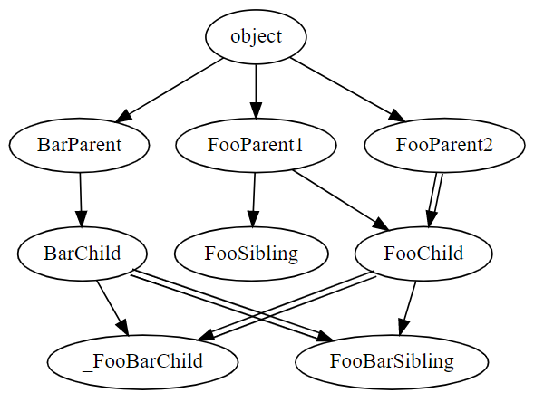

## Create Inheritance Trees!
This package allows users to create complex tree graphs by parsing through packages and modules and extracting classes and their mros. This data is used to generate a graphviz image that traces the inheritance of each class back to the original base class.
To create graph run:
```
loc = r'C:\Users\You\Python_Scripts\Package\src'

Tree = InheritanceTree()
Tree.create_tree(loc)
Tree.create_graph()
```

